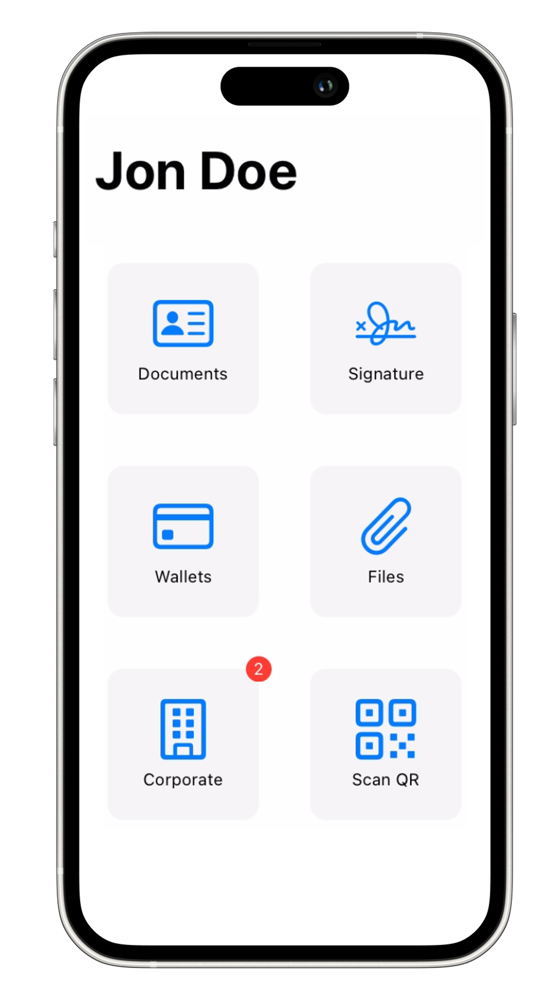
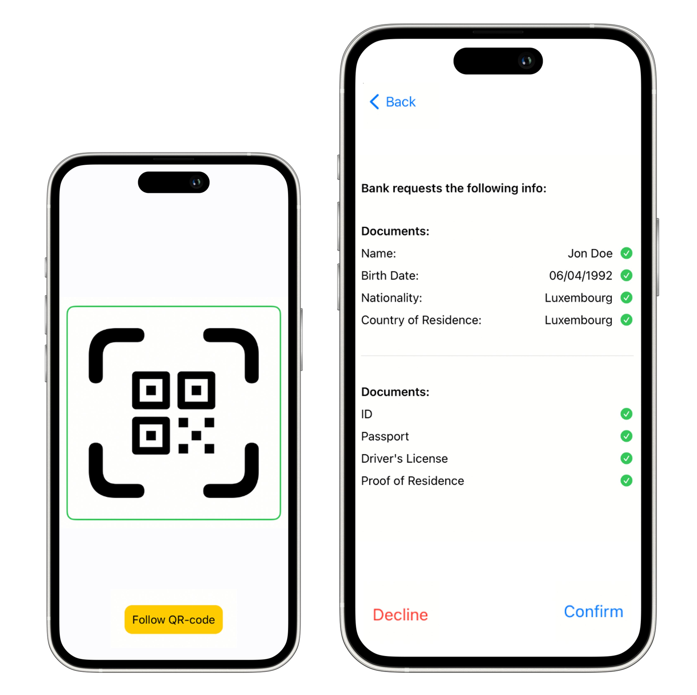
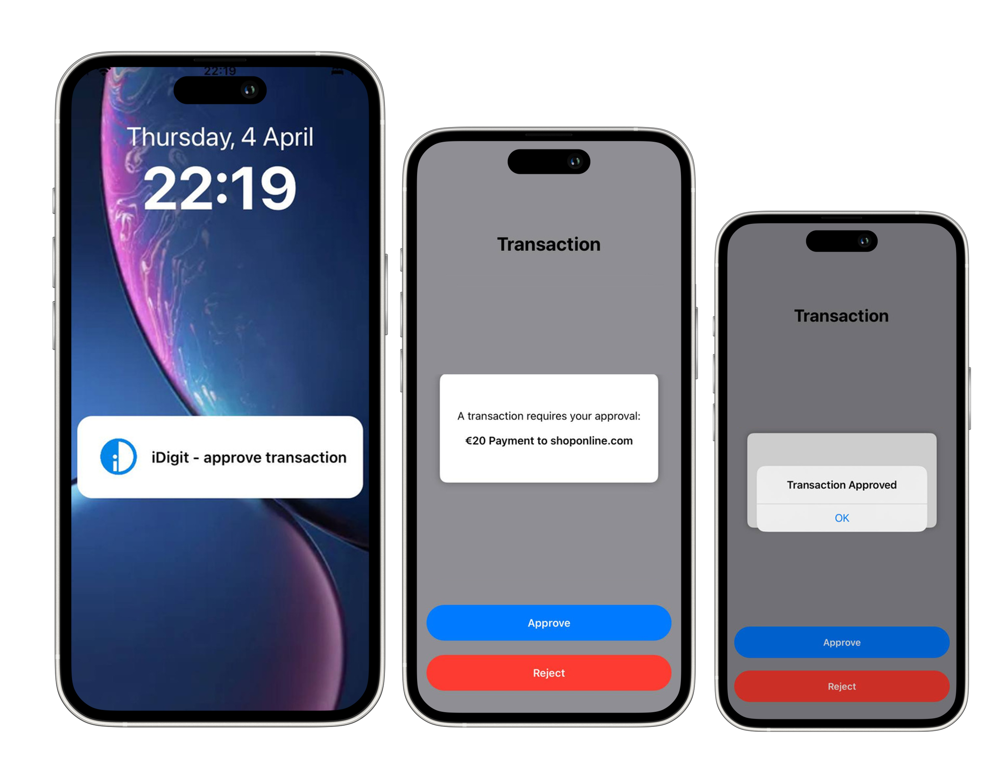
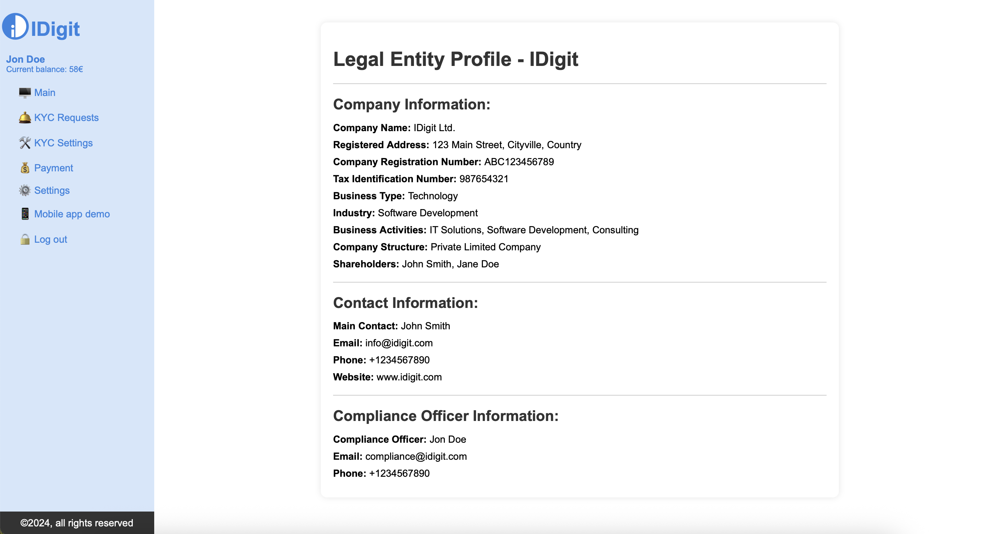
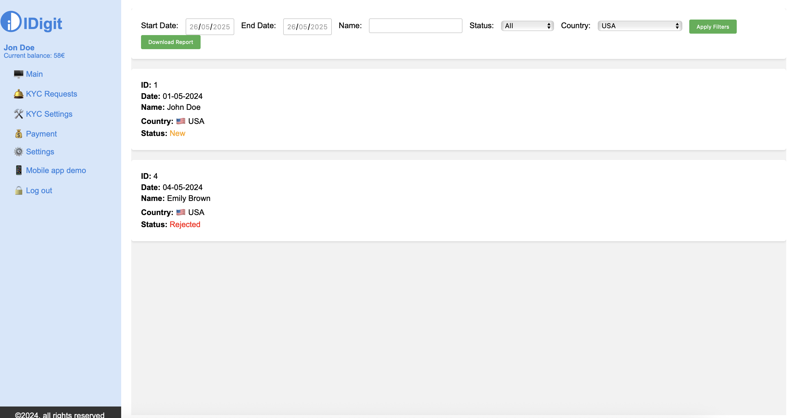
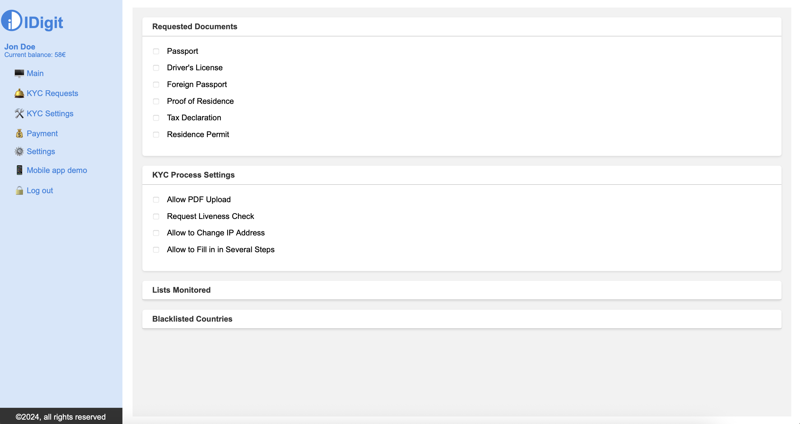
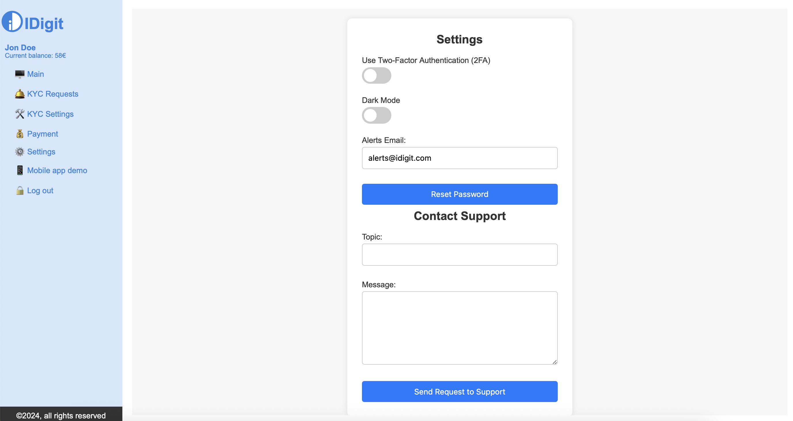

# iDigit – Digital Identity Revolution

**iDigit** revolutionizes digital identity management by seamlessly blending advanced technologies with user-centric design.  
Our platform provides a **secure, intuitive solution** for establishing, verifying, and managing digital identities across a wide range of applications and services.

iDigit empowers users with full control over their credentials, using **blockchain authentication** to ensure data integrity and eliminate the need for third-party intermediaries.

---

## 🚀 Mobile App – Core Features

### ✅ Digital Identity Management
Simplify the creation, storage, and verification of credentials using decentralized blockchain technology.

### ✍️ Sign and Send Documents
Use your verified digital profile to legally sign and share documents with ease and security.

### 🔐 Seamless Identity Confirmation
Log in to services, onboard providers, and complete KYC/KYB checks in one click while retaining control over your data.

### 📲 Secure Login & Transaction Confirmation
Receive real-time push notifications for fast and secure transaction approvals, document signings, and other sensitive actions.

---

## 📱 Mobile App – Screenshots

  
  
  
  
  
  

---

## 🖥 Web Interface – Admin Features

### 📋 Simplified Onboarding
Enable compliance teams to manage onboarding processes effortlessly — even with outsourced KYC providers.

### 🛠 Tailored KYC Solutions
Define mandatory documents, opt for liveness checks, manage regional settings (e.g., blacklisted countries), and customize workflows by geography and user type.

---

## 💻 Web Interface – Screenshots

  
  
  
  

---

## 📎 Technologies Used

- Decentralized Identity (DID)
- Blockchain Authentication
- Mobile iOS App (Swift)
- Web Admin Dashboard (React or similar)

---

## 📬 Contact

Text for inquiries or collaboration.
Project by **iDigit Team**

